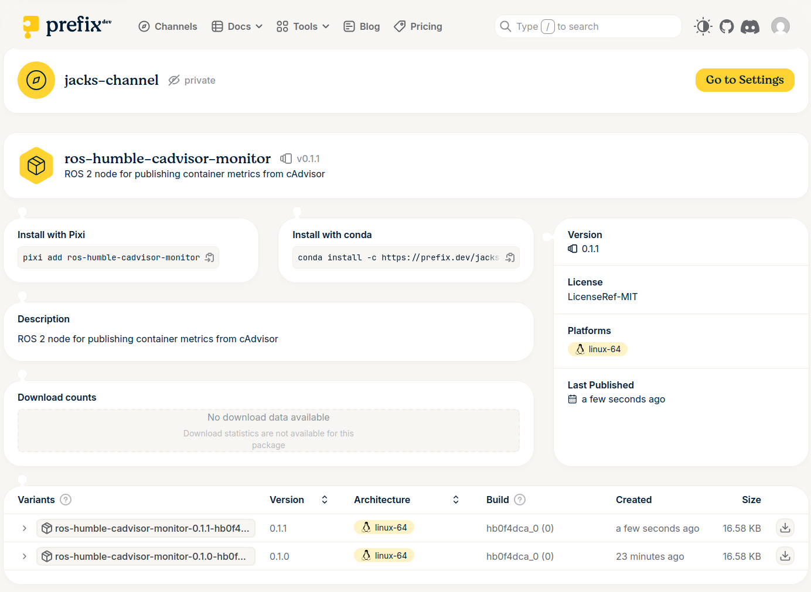

# cAdvisor Monitor

Fetches container metrics from cAdvisor and publishes them as ROS 2 statistics messages.

## Quick Start

```bash
pixi install
pixi run monitor          # Standalone CLI
pixi run ros-run          # ROS 2 node
```

## Project Structure

```
process_monitor/
├── pixi.toml                          # [1] Workspace config
├── scripts/
│   └── top_cpu_usage.py               # Standalone CLI tool
└── src/cadvisor_monitor/              # ROS 2 package
    ├── pixi.toml                      # [2] Package build config
    ├── package.xml                    # [3] ROS package manifest
    ├── setup.py                       # [4] Python package setup
    ├── setup.cfg                      # [5] Install paths
    ├── resource/cadvisor_monitor      # [6] Ament resource marker
    └── cadvisor_monitor/              # [7] Python module
        ├── __init__.py
        ├── cadvisor.py                # cAdvisor API client
        └── container_stats_publisher.py  # ROS 2 node
```

## Build Chain

```
pixi install
     │
     ▼
┌─────────────────────────────────────────────────────────┐
│  [1] pixi.toml (workspace)                              │
│  - Defines channels (robostack-humble, conda-forge)     │
│  - Lists dependencies (python, requests, ros2 tools)    │
│  - References local package: path = "src/cadvisor_monitor" │
└─────────────────────────────────────────────────────────┘
     │
     ▼
┌─────────────────────────────────────────────────────────┐
│  [2] src/cadvisor_monitor/pixi.toml                     │
│  - Configures pixi-build-ros backend                    │
│  - Sets ROS distro = "humble"                           │
│  - Tells pixi HOW to build this package                 │
└─────────────────────────────────────────────────────────┘
     │
     ▼
┌─────────────────────────────────────────────────────────┐
│  [3] package.xml (ROS manifest)                         │
│  - Package name, version, description                   │
│  - Dependencies: rclpy, statistics_msgs, std_msgs       │
│  - Build type: ament_python                             │
│  - pixi-build-ros reads this to resolve dependencies    │
└─────────────────────────────────────────────────────────┘
     │
     ▼
┌─────────────────────────────────────────────────────────┐
│  [4] setup.py + [5] setup.cfg                           │
│  - Standard Python setuptools                           │
│  - Defines entry points (console_scripts)               │
│  - Lists data_files for ROS (resource marker, package.xml) │
│  - pixi-build-ros runs: python setup.py install         │
└─────────────────────────────────────────────────────────┘
     │
     ▼
┌─────────────────────────────────────────────────────────┐
│  [6] resource/cadvisor_monitor (empty file)             │
│  - Ament index marker                                   │
│  - Installed to share/ament_index/resource_index/packages/ │
│  - Allows `ros2 pkg list` to discover the package       │
└─────────────────────────────────────────────────────────┘
     │
     ▼
┌─────────────────────────────────────────────────────────┐
│  Output: .pixi/envs/default/                            │
│  - Conda environment with all dependencies              │
│  - Package installed as ros-humble-cadvisor-monitor     │
│  - Ready to run: ros2 run cadvisor_monitor ...          │
└─────────────────────────────────────────────────────────┘
```

## File Reference

| File | Purpose |
|------|---------|
| `pixi.toml` (root) | Workspace: channels, dependencies, tasks |
| `src/.../pixi.toml` | Package: build backend config for pixi-build-ros |
| `package.xml` | ROS: package metadata, dependencies (read by pixi-build-ros) |
| `setup.py` | Python: package installation, entry points |
| `setup.cfg` | Python: install script paths for ROS |
| `resource/cadvisor_monitor` | ROS: empty marker file for ament index |

## Why Two pixi.toml Files?

- **Workspace** (`./pixi.toml`): Manages the environment, lists what packages to install
- **Package** (`src/.../pixi.toml`): Tells pixi-build-ros how to build THIS package into a conda artifact

This separation allows building the package independently (`pixi build`) for distribution.

More info on building ROS packages with Pixi [here](https://pixi.prefix.dev/v0.58.0/build/ros/) and [here](https://prefix-dev.github.io/pixi-build-backends/backends/pixi-build-ros/)

## Tasks

```bash
pixi run monitor        # Standalone CLI monitor
pixi run monitor-all    # With network/disk stats
pixi run ros-run        # ROS 2 node (default: localhost:8080)
pixi run ros-topics     # List ROS topics
pixi run ros-echo-cpu   # Echo CPU stats topic
```

## ROS 2 Node Parameters

```bash
ros2 run cadvisor_monitor container_stats_publisher \
    --ros-args -p cadvisor_url:=http://beelinkmini:8060
```

| Parameter | Default | Description |
|-----------|---------|-------------|
| `cadvisor_url` | `http://localhost:8080` | cAdvisor API URL |
| `publish_rate` | `1.0` | Publishing frequency (Hz) |
| `name_refresh_interval` | `30` | Container name cache TTL (seconds) |


# Packaging and deployment
This can be packaged as a Conda package and pushed to your own prefix.dev channel using the `pixi run publish` task.
First make a free prefix.dev account and set up a private channel. You will need to replace the occurances in the `pixi.toml`
where it refers to `jacks-channel` as that is my private channel.
You will need to have your prefix repo auth'd using `pixi auth login repo.prefix.dev --token $PREFIX_AUTH`
You should also make sure that `$PREFIX_AUTH` token is in the environment when you run publish.
Once the build is complete you should see it get pushed up to your private channel.
To test out running from the upstream package have a look at the [dependancies] section of the pixi.toml and switch out the
development and deployment lines.  

To rebuild
```
rm pixi.lock && pixi install
```
You can then check the source of the cadvisor package using `pixi list`

